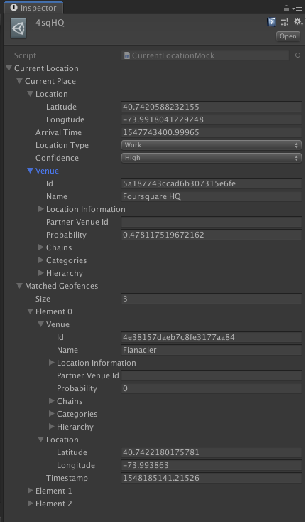
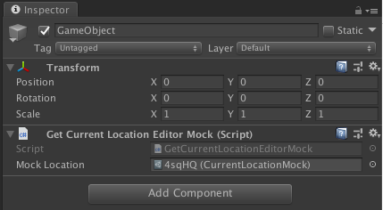

# Pilgrim Unity SDK

[](https://circleci.com/gh/foursquare/pilgrim-unity-sdk)

Pilgrim Unity SDK is a package which enables easy integration with the [Pilgrim SDK](https://enterprise.foursquare.com/products/pilgrim) in a Unity project. This package supports a subset of the iOS and Android SDKs which currently includes the following functionality:

* Passive location detection with notifications received via [Webhooks](https://developer.foursquare.com/docs/pilgrim-sdk/webhooks) and other [third-party integrations](https://developer.foursquare.com/docs/pilgrim-sdk/integrations)
* Getting the user's [Current Location](https://developer.foursquare.com/docs/pilgrim-sdk/quickstart#get-current-location)
* Sending [Custom User Data](https://developer.foursquare.com/docs/pilgrim-sdk/advanced-setup-guide#custom-user-data)

## Table of Contents
* [Requirements](#requirements)
* [Installing](#installing)
* [Usage](#usage) 
    * [Application Setup](#application-setup)
    * [PilgrimUnitySDK C# Class](#pilgrimunitysdk-c-class)
    * [Location Permissions](#location-permissions)
    * [Getting User's Current Location](#getting-users-current-location)
    * [Mocking Editor Locations](#mocking-editor-locations)
    * [Passive Location Detection](#passive-location-detection)
    * [Sending Custom User Data](#sending-custom-user-data)
    * [Debug Screen](#debug-screen)
    * [Test Visits](#test-visits)
* [Samples](#samples)
* [FAQ](#faq)

## Requirements

This package has been tested with Unity versions 2017.1.5f1+, however to use the Android autogenerated App.java/AndroidManifest.xml [feature](#android-setup) you must be using version 2018.2.0+, prior to this version .java files were not treated as source files for Android plugins, see [release notes](https://unity3d.com/unity/whats-new/unity-2018.2.0).

The iOS SDK requires iOS 8+ and the Android SDK requires API level 15+ (ICE_CREAM_SANDWICH_MR1).

## Installing

Download the latest release from the [Releases](https://github.com/foursquare/pilgrim-unity-sdk/releases) page, it will list which versions of Pilgrim it supports for iOS and Android.  In Unity select the menu item `Assets > Import Package > Custom Package` and open the downloaded package.

## Usage

If you do not have a Foursquare API key whitelisted for Pilgrim access, read our guide on [Foursquare API Access](https://developer.foursquare.com/docs/pilgrim-sdk).

### Application Setup

The first step is configuring your project to work properly with Pilgrim SDK:
* Select the menu item `Assets > Pilgrim Unity SDK > Configuration` and input your consumer key and secret and press Save
* For iOS there is also an option to copy the string set in `Location Usage Description` in `Player Settings` to the `NSLocationAlwaysAndWhenInUseUsageDescription` entry in the `Info.plist` when building, which is required for passive location detection.
* Ensure you set the `Bundle Identifier` for iOS and `Package Name` for Android in Player Settings.
* For iOS you must enable the background location capability by setting `Behavior in Background` to `Custom` in `Player Settings` and checking `Location updates`. Also ensure you have added a description in `Location Usage Description` in `Player Settings`.
* For the Android SDK to authenticate with our server you will also need to set your Android Key Hash on your Foursquare application settings page, more information [here](https://developer.foursquare.com/docs/pilgrim-sdk/quickstart#android). Then you need to configure Unity to use your keystore in the `Publishing Settings` section of `Player Settings`.

The next step is ensuring Pilgrim Unity SDK is started on application launch:

#### iOS Setup

 You must call `[PilgrimUnitySDK initWithConsumerKey:consumerSecret:]` from `application:didFinishLaunchingWithOptions` in a `UnityAppController` subclass. You can have the `UnityAppController` subclass autogenerated and added to the project by selecting the menu item `Assets > Pilgrim Unity SDK > iOS > Generate AppController.m`. 

Alternatively, if you already have a `UnityAppController` subclass or need to do this manually ensure you call `[PilgrimUnitySDK initWithConsumerKey:consumerSecret:]` as described above, for example:

```
// MyAppController.m
#import "UnityAppController.h"
#import "PilgrimUnitySDK.h"

@interface MyAppController : UnityAppController

@end

IMPL_APP_CONTROLLER_SUBCLASS(MyAppController)

@implementation MyAppController

- (BOOL)application:(UIApplication *)application didFinishLaunchingWithOptions:(NSDictionary *)options {
    [PilgrimUnitySDK initWithConsumerKey:@"CONSUMER_KEY" consumerSecret:@"CONSUMER_SECRET"];

    // Other code

    return [super application:application didFinishLaunchingWithOptions:options]; 
}

@end

```

Then add the .m file to `Assets/Plugins/iOS`.  You can learn more about the `UnityAppController` class [here](https://docs.unity3d.com/Manual/StructureOfXcodeProject.html)

#### Android Setup

You must call `PilgrimUnitySDK.init` from the `onCreate` method in an `android.app.Application` subclass. You can have the `android.app.Application` subclass autogenerated and added to the project by selecting the menu item `Assets > Pilgrim Unity SDK > Android > Generate App.java`. Additionally, you need to create an `AndroidManifest.xml` that sets up the application to use your `android.app.Application` subclass.  This can also be autogenerated and added to the project by selecting the menu item `Assets > Pilgrim Unity SDK > Android > Generate AndroidManifest.xml`.  

Alternatively, if you already have an `android.app.Application` subclass or need to do this manually ensure you call `PilgrimUnitySDK.init` as described above, for example:

```
package com.company.app;

// App.java

import android.app.Application;

import com.foursquare.pilgrimunitysdk.PilgrimUnitySDK;

public final class MyApp extends Application {

    @Override
    public void onCreate() {
        super.onCreate();
        PilgrimUnitySDK.init(this, "CONSUMER_KEY", "CONSUMER_SECRET");

        // Other code
    }

}
```

Also ensure your `AndroidManifest.xml` sets the `android.app.Application` subclass properly, for example:

```
<?xml version="1.0" encoding="utf-8"?>
<manifest xmlns:android="http://schemas.android.com/apk/res/android" package="com.company.app" xmlns:tools="http://schemas.android.com/tools" android:installLocation="preferExternal">
  <supports-screens android:smallScreens="true" android:normalScreens="true" android:largeScreens="true" android:xlargeScreens="true" android:anyDensity="true" />
  <application android:name="com.company.app.MyApp" android:theme="@style/UnityThemeSelector" android:icon="@mipmap/app_icon" android:label="@string/app_name">
    <activity android:name="com.unity3d.player.UnityPlayerActivity" android:label="@string/app_name">
      <intent-filter>
        <action android:name="android.intent.action.MAIN" />
        <category android:name="android.intent.category.LAUNCHER" />
      </intent-filter>
      <meta-data android:name="unityplayer.UnityActivity" android:value="true" />
    </activity>
    <activity android:name="com.foursquare.pilgrimsdk.debugging.PilgrimSdkDebugActivity" android:theme="@style/Theme.AppCompat.Light.DarkActionBar"/>
  </application>
</manifest>
```

Then add the .java/.xml files to `Assets/Plugins/Android`.

### PilgrimUnitySDK C# Class

All interactions with Pilgrim SDK in Unity happen through static methods in the `PilgrimUnitySDK` class in the `Foursquare` namespace.  `PilgrimUnitySDK` uses actions (`System.Action`) when it needs to communicate information back to the Unity application for [Location Permissions](#location-permissions) and [Getting User's Current Location](#getting-users-current-location)

### Location Permissions

Pilgrim SDK requires iOS user's to allow 'always' authorization for passive location detection and 'when in use' authorization for getting the user's current location. For Android it requires `ACCESS_FINE_LOCATION` for both. You can handle requesting these permissions using your own flow or you can use the `PilgrimUnitySDK.RequestLocationPermissions()` method. You should set the `PilgrimUnitySDK.OnLocationPermissionResult` action before calling this method. For iOS this method request 'always' authorization'. Additionally, by default for Android 6.0+ Unity will request on application launch the user's permission for location access, you can disable this and request permission when needed in your flow by adding the `unityplayer.SkipPermissionsDialog` meta data value to your `AndroidManifest.xml` and setting to true, more information [here](https://docs.unity3d.com/Manual/android-manifest.html). The generated `AndroidManifest.xml` in [Application Setup](#application-setup) adds this meta data value. Example usage below:

```
using Foursquare;
using UnityEngine;

public class GameManager : MonoBehaviour
{

    void OnEnable()
    {
        PilgrimUnitySDK.OnLocationPermissionResult += OnLocationPermissionResult;
    }

    void OnDisable()
    {
        PilgrimUnitySDK.OnLocationPermissionResult -= OnLocationPermissionResult;
    }

    void Start()
    {
        PilgrimUnitySDK.RequestLocationPermissions();
    }

    private void OnLocationPermissionResult(bool granted)
    {
        if (granted) {
            // Do Stuff
        }
    }

}
```

### Getting User's Current Location

You can actively request the current location of the user by calling the `PilgrimUnitySDK.GetCurrentLocation()` method.  You should set the `PilgrimUnitySDK.OnGetCurrentLocationResult` action first and it will be called with a `CurrentLocation` object that has the current venue the device is most likely at as well as any geofences that the device is in (if configured). More information [here](https://developer.foursquare.com/docs/pilgrim-sdk/quickstart#get-current-location). Example usage below:

```
using Foursquare;
using UnityEngine;

public class GameManager : MonoBehaviour
{

    void OnEnable()
    {
        PilgrimUnitySDK.OnGetCurrentLocationResult += OnGetCurrentLocationResult;
    }

    void OnDisable()
    {
        PilgrimUnitySDK.OnGetCurrentLocationResult -= OnGetCurrentLocationResult;
    }

    void Start()
    {
        PilgrimUnitySDK.GetCurrentLocation();
    }

    private void OnGetCurrentLocationResult(CurrentLocation currentLocation, Exception exception)
    {
        Debug.Log(currentLocation.CurrentPlace.Venue.Name);
    }

}
```

### Mocking Editor Locations

When running your Unity project in the editor it is possible to mock the location returned by the `PilgrimUnitySDK.GetCurrentLocation()` method.  To do this first you need to create a `CurrentLocationMock` asset by selecting the menu item `Assets > Create > Pilgrim > Mock Current Location`.  When selected you can configure in the inspector the `CurrentLocation` fields.  Then you need to attach a `GetCurrentLocationEditorMock` component to a `GameObject` in your scene, and set the `Mock Location` property to the .asset you created.  When run in the editor the `PilgrimUnitySDK.OnGetCurrentLocationResult` action will return the `CurrentLocation` you set in the `GetCurrentLocationEditorMock` component.





### Passive Location Detection

Passive location detection is controlled with the `PilgrimUnitySDK.Start()` and `PilgrimUnitySDK.Stop()` methods. When started Pilgrim SDK will send notifications to [Webhooks](https://developer.foursquare.com/docs/pilgrim-sdk/webhooks) and other [third-party integrations](https://developer.foursquare.com/docs/pilgrim-sdk/integrations).  Example usage below:

```
using Foursquare;
using UnityEngine;

public class GameManager : MonoBehaviour
{

    void OnEnable()
    {
        PilgrimUnitySDK.Start();
    }

    void OnDisable()
    {
        PilgrimUnitySDK.Stop();
    }

}
```

### Sending Custom User Data

Custom user data can be sent to Pilgrim to be passed along to other services using the `PilgrimUnitySDK.SetUserInfo()` method.  More information on custom user data is available [here](https://developer.foursquare.com/docs/pilgrim-sdk/advanced-setup-guide#custom-user-data). Example usage below:

```
using Foursquare;
using UnityEngine;

public class GameManager : MonoBehaviour
{

    void Start()
    {
        var userInfo = new UserInfo();
        userInfo.SetUserId("user_id");
        userInfo.SetBirthday(new System.DateTime(2000, 1, 1));
        userInfo.SetGender(UserInfo.Gender.Female);
        userInfo.Set("key", "value");
        PilgrimUnitySDK.SetUserInfo(userInfo);
    }

}
```

Custom user data can also be retreived from Pilgrim SDK using `PilgrimUnitySDK.GetUserInfo()` method. 

```
using Foursquare;
using UnityEngine;

public class GameManager : MonoBehaviour
{

    void Start()
    {
        var userInfo = PilgrimUnitySDK.GetUserInfo();
        // Do Stuff
    }

}
```

### Debug Screen

The debug screen is shown using the `PilgrimUnitySDK.ShowDebugScreen()` method. This screen contains logs sent from Pilgrim SDK and other debugging tools/information. Example usage below:


```
using Foursquare;
using UnityEngine;

public class GameManager : MonoBehaviour
{

    void Start()
    {
        PilgrimUnitySDK.ShowDebugScreen();
    }

}
```

To use on Android the base application theme must be or descend from `Theme.AppCompat`, otherwise you need to declare the activity in your `AndroidManifest.xml` like below. The generated `AndroidManifest.xml` in [Application Setup](#application-setup) automatically adds this. 

```
<activity android:name="com.foursquare.pilgrimsdk.debugging.PilgrimSdkDebugActivity" android:theme="@style/Theme.AppCompat.Light.DarkActionBar"/>
```

### Test Visits

Test arrival visits can be fired with the method `PilgrimUnitySDK.FireTestVisit()`. You must pass a location to be used for the test visit. The arrival notification will be received via [Webhooks](https://developer.foursquare.com/docs/pilgrim-sdk/webhooks) and other [third-party integrations](https://developer.foursquare.com/docs/pilgrim-sdk/integrations)

```
using Foursquare;
using UnityEngine;

public class GameManager : MonoBehaviour
{

    void Start()
    {
        PilgrimUnitySDK.FireTestVisit(new Location(41.889264, -87.628911));
    }

}
```

## Samples

* [Pilgrim Demo](https://github.com/foursquare/pilgrim-unity-sdk/tree/master/samples/PilgrimDemo) - Basic application using PilgrimUnitySDK

* [Pilgrim Mapbox](https://github.com/foursquare/pilgrim-unity-sdk/tree/master/samples/PilgrimMapbox) - Application using PilgrimUnitySDK and Mapbox to render a 3D map of user's current location

## FAQ

Consult the Pilgrim documentation [here](https://developer.foursquare.com/docs/pilgrim-sdk/FAQ)
