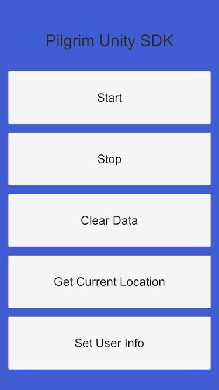
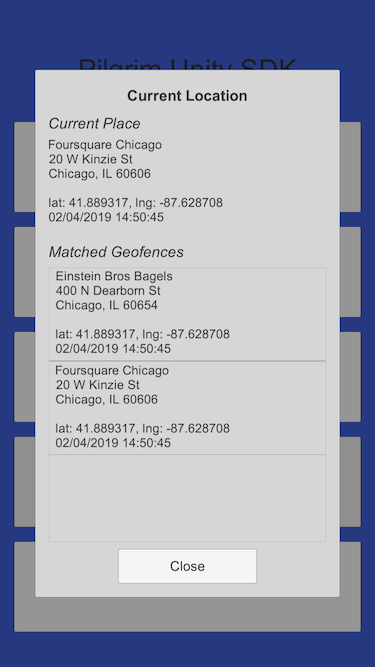

# Pilgrim Demo

This demo project shows how to integrate the PilgrimUnitySDK into a basic app. To run the project open this directory in Unity, then open `Assets/PilgrimDemo/Scenes/MainScene.unity`, then follow the directions in [Application Setup](https://github.com/foursquare/pilgrim-unity-sdk#application-setup). After setup you can build and run for iOS and Android.

